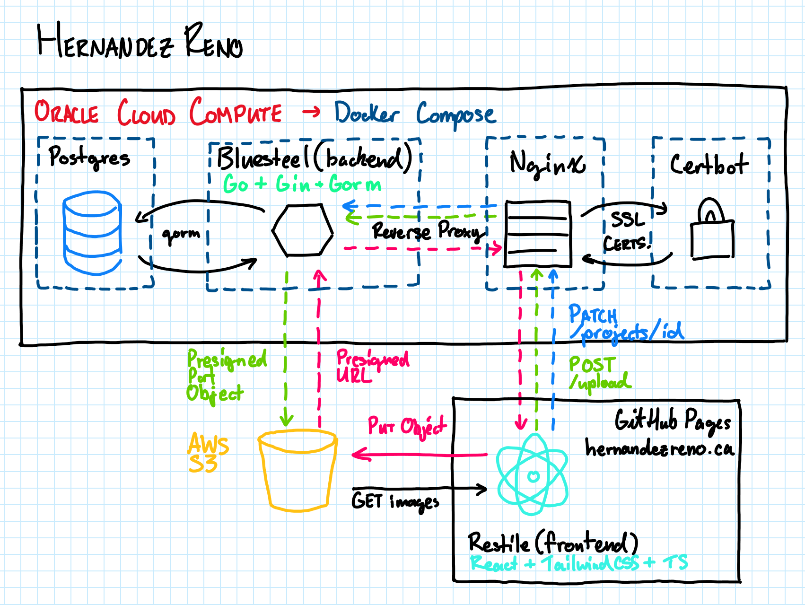

# HernandezReno
A professional website for Hernandez Renovations custom kitchens and finish carpentry.


[](https://github.com/RRickyH/HernandezReno/actions/workflows/blank.yml)


**Check it out:** [hernandezreno.ca](https://hernandezreno.ca)<br>

## Motivation
<hr/>
Throughout my teenage years I helped out my dad with his kitchen design business, Hernandez Renovations. This was a pretty
exciting and active way to contribute to our household and also kept me busy during the summer and after I graduated from highschool.
Eventually it came to the point where I was off to other things and I began studying Computer Engineering at the University of Waterloo.
This was a completely different environment to me and I found myself in need of many new skills in this multi-disciplinary program.
Web development had always been a mystery to me and I decided that I wanted to create a project which would use industry
standard technologies so that I could de-mystify this a bit and learn more about how the web works. For a time searching
for a project to make was difficult; it feels like it's all been done before. That's when the idea to make hernandezreno.ca came to me.
Though I can't work with my dad anymore, this project is a way for me to give back again and contribute except instead of building
kitchens I'm building a website. And hopefully this will help us get more clients during the slow winter months...

## Design Decisions
<hr/>
A core principle to me when designing this project was configuration. I want my parents to be able to add new projects 
and change images without needing changes to hard-coded values. I decided that to implement this I would use a backend and
a database to manage these configurations. For the backend, I decided to use Go because it is C-adjacent and is used 
to make scalable backends by many large companies like Google. It also has a very strong standard library and was easy to 
learn. For the database, I decided to use postgresql because it is a very popular relational database for which I had some 
experience during my first coop. For the frontend I decided to use React because of it was easy to learn and widely used 
as well as tailwindcss due to strength in rapid development. Along the way I came across several key decisions listed below...

### Hosting
  * Hosting a production-level application presented several challenges for me as I had to balance complexity, costs, and capability.
    For the front end I decided to use GitHub pages because it provides all of my needed functionality for free and integrates well
    with the source code using GitHub Actions. The backend and database were more of a challenge. Traditional cloud providers like
    AWS and Azure obviously have options, but I decided that these were overkill and too expensive for the scale of my app.
    Instead I decided to use Oracle Cloud and run my backend and database using docker compose within a compute instance. This
    allows me to host the backend for free since it falls within Oracle's free tier and also performs very well.

### Image Storage
  * Images can often be large files especially with high resolution. Given the quantities of images being uploaded I decided
    to get a dedicated provider for storing these images rather than trying to fit them in the backend. This both frees up storage
    on the database and also allows for faster and more secure access. I decided to go with AWS S3 because it is an industry standard and is well-tested and secure.


### Image Uploading
  * Because I chose to use S3 for image storage, I needed to find a way to upload and access images. The best solution
    that I found was to use the backend as a 'validator' to check credentials on behalf of AWS and then allow the frontend to
    upload the images itself. This was achieved using presigned objects and operations from S3. This keeps the backend lean and
    eliminates the complexity associated with passing whole files to the backend.

## Project Architecture
<hr/>

### Stack
  * **Frontend:** React, Tailwind CSS, Typescript, Vite (build)
  * **Backend:** Gin, Gorm, Go, AWS SDK, Air (development)
  * **Database:** Postgres, Gorm migrations (AutoMigrate)
  * **Object Storage:** AWS S3
  * **Hosting:** GitHub Pages (frontend), Oracle Cloud Compute Instance (backend)
  * **Deployment:** Docker, Docker Compose, Nginx, Certbot (SSL/TLS Certificates), GitHub Actions

Below is a diagram describing the system architecture of the project including arrows showing the flow for uploading 
projects. When an admin uploads a new project from the admin dashboard, the frontend sends an initial request to create 
the project with text fields. The backend gets this request and returns the ID of the created project. The frontend then
sends a presigned url request to the backend for each image. The backend validates the file type and authentication token
and then sends a request using the AWS S3 SDK to generate a presigned url for uplodaing. This is then sent back to the 
frontend, which then directly uploads to the S3 bucket. This approach allows the postgres database to be a minimal size
since it only needs to store text data for projects and the image keys for each image. These image keys can be combined
with the bucket's URL to create a public URL for the purposes of displaying these images; as is done when the user visits
the gallery page.

### Image Upload Flow
  - Client creates a project with new images
  - Frontend sends a POST request to the backend's /uploader endpoint with the file name, content type, and project ID 
  - Nginx receives the request and forwards this to the backend
  - Backend validates the query parameters and creates an image key which is sent in a PresignedPutObject request to AWS
  - AWS responds with a presigned url which can be used to upload an image
  - Backend sends the url and image key back to the frontend through Nginx
  - Frontend uses the presigned url to fetch a PUT request to AWS uploading the file
  - Frontend fetches a PATCH request with the project ID and the image keys of all uploaded images to update the project
<br/><br/>


## API
<hr/>

### List Settings
```GET /settings``` <br><br>
This gets the site settings configurations.
* **Authorization:** None
* **Body:** None
* **Response:** 200 OK
  ```json
    {
      "titleText": "...",
      "accentText": "...",
      "tagLine": "...",
      "heroImageURL": "...",
      "aboutDescription": "...",
      "aboutImageURL": "..."
    }
  ```
### Update Settings
```PUT /settings``` <br><br>
This gets updates the settings with the provided object. All fields are nullable. Fields which haven't been provided are
left unchanged.
* **Authorization:** Bearer {JWT}
* **Body:** 
  ```json
    {
      "titleText": "...",
      "accentText": "...",
      "tagLine": "...",
      "heroImageURL": "...",
      "aboutDescription": "...",
      "aboutImageURL": "..."
    }
  ```
* **Response:** 204 No Content

### Login
```POST /login``` <br><br>
This validates the credentials and returns a JWT if successful.
* **Authorization:** None
* **Body:** 
  ```json
  {
    "username": "Super Testing Admin",
    "password": "Super Secret Password"
  }
  ```
* **Response:** 200 OK
  ```json
  {
    "token": {JWT}
  }
  ```
### Send Contact Email
```POST /email``` <br><br>
This sends an email with the contents of the contact form.
* **Authorization:** None
* **Body:** 
  ```json
  {
    "name": "Super Testing Client",
    "email": "supertestingclient@email.com",
    "phone": "1234567890",
    "subject": "I wanna chat!",
    "message": "What's for dinner?"  
  }
  ```
* **Response:** 200 OK

### Get Presigned URL
```POST /uploader``` <br><br>
This generates a presigned url for image uploading.
* **Authorization:** Bearer {JWT}
* **Query Parameters**: 
  ```json
  {
    "filename": "superImage.png",
    "contentType": "image/png",
    "projectID": "7"  
  }
  ```
* **Body:** None
* **Response:** 200 OK
  ```json
  {
    "url": "https://cdn.com/projects/7/...",
    "objectKey": "projects/7/..."
  }
  ```

### Check Login
```GET /settings``` <br><br>
Checks that the authorization is valid and not expired.
* **Authorization:** Bearer {JWT}
* **Body:** None
* **Response:** 200 OK

<details>
  <summary><b>Projects</b></summary>
  <br>

  ### List Projects
```GET /projects``` <br><br>
This endpoint returns all projects in a json-coded array.
  * **Authorization:** None
  * **Body:** None
  * **Response:** 200 OK

    ```json
    [
      {
        "id":"4",
        "title":"The Thomas Project",
        "imageKeys": [
          "projects/4/...",
          "projects/4/..."
        ],
        "date":null,
        "tags": [
          "Shaker",
          "Modern"
        ],
        "description":"project description..."
      },
      {
        "id":"5",
        "title":"Super Testing Project 5",
        "imageKeys": [
          "projects/5/...",
          "projects/5/...",
          "projects/5/..."
        ],
        "date":null,
        "tags": [
          "Bright"
        ],
        "description":"project description..."
      },
      ...
    ]
    ```
### List Project Images
```GET /projects/{id}/images``` <br><br>
This endpoint returns the object keys for all images corresponding to a project.
* **Authorization:** None
* **Body:** None
* **Response:** 200 OK
  ```json
  [
    "projects/2/...",
    "projects/2/...",
    "projects/2/..."
  ]
  ```
### Add Project
```POST /projects``` <br><br>
This adds a new project. The description and tags are nullable fields.
* **Authorization:** Bearer {JWT}
* **Body:**
  ```json
  {
    "title": "Super Testing Project",
    "tags": [
      "Tag1", 
      "Tag2"
    ],
    "description": "My project description..."
  }
  ```
* **Response:** 201 Created
  ```json
  {
    "status": "Added Project", "id": {id}
  }
  ```

### Delete Project
```DELETE /projects/{id}``` <br><br>
This deletes the project corresponding to the project ID provided.
* **Authorization:** Bearer {JWT}
* **Body:** None
* **Response:** 204 No Content

### Update Project
```PATCH /projects/{id}``` <br><br>
This updates a given project based on the fields which are provided. If nothing is provided the project remains unchanged.
If tags are provided, these overwrite the existing tags. If new images are provided, they overwrite existing images.
* **Authorization:** Bearer {JWT}
* **Body:**
  ```json
  {
    "title": "New Super Testing Title",
    "tags": [
      "NewTag 1" 
    ],
    "imageKeys": [
      "projects/{id}/newImageKey.png"
    ],
    "description": "My new project description."
  }
  ```
* **Response:** 204 No Content
</details>
<details>
  <summary><b>Tags</b></summary>

### List Tags
```GET /tags``` <br><br>
This returns a collection of all the tags used by projects.
* **Authorization:** None
* **Body:** None
* **Response:** 200 OK

  ```json
  [
    "tag1",
    "tag2",
    "tag3",
    ...
  ]
  ```

### Delete Tag
```DELETE /tags/{name}``` <br><br>
This deletes the corresponding tag.
* **Authorization:** Bearer {JWT}
* **Body:** None
* **Response:** 204 No Content

</details>
<details>
  <summary><b>People</b></summary>

### List People
```GET /person``` <br><br>
This endpoint returns all people.
* **Authorization:** None
* **Body:** None
* **Response:** 200 OK

  ```json
  [
    {
      "id":"4",
      "name":"Super Testing Employee",
      "role": "Tester",
      "photoURL": "https://imageURL.png",
      "description":"person description..."
    },
    {
      "id":"2",
      "name":"Super Testing Employee 2",
      "role": "Senior Tester",
      "photoURL": "https://imageURL.png",
      "description":"person description..."
    },
    ...
  ]
  ```
### List Person
```GET /person/{id}``` <br><br>
This returns the person matching the id.
* **Authorization:** None
* **Body:** None
* **Response:** 200 OK
  ```json
  {
  "id": "7",
  "name": "Super Tester",
  "role": "Tester",
  "photoURL": "https://testerPhoto.png",
  "description": "my testing description..."  
  }
  ```
### Add Person
```POST /person``` <br><br>
This adds a new person. The description and tags are nullable fields.
* **Authorization:** Bearer {JWT}
* **Body:**
  ```json
  {
    "title": "Super Testing Project",
    "tags": [
      "Tag1", 
      "Tag2"
    ],
    "description": "My project description..."
  }
  ```
* **Response:** 201 Created
  ```json
    {
      "status": "Added Person",
      "id": {id}
    }
  ```

### Delete Person
```DELETE /person/{id}``` <br><br>
This deletes the person corresponding to the ID provided.
* **Authorization:** Bearer {JWT}
* **Body:** None
* **Response:** 204 No Content

### Update Person
```PATCH /person/{id}``` <br><br>
This updates a given person based on the fields which are provided. If nothing is provided the person remains unchanged.
* **Authorization:** Bearer {JWT}
* **Body:**
  ```json
  {
    "name": "New Super Testing Employee",
    "role": "New Super Testing Role",
    "photoURL": "http://superPhotoURL.png",
    "description": "My new person description..."
  }
  ```
* **Response:** 204 No Content
</details>

## Models
<hr/>

<details><summary><b>Show</b></summary>

**Project** <br/>
```go
type Project struct {
	gorm.Model
	ID          ProjectID  `gorm:"primaryKey"`
	Title       *string    `gorm:"size:150;not null" json:"title,omitempty"`
	Images      []Image    `gorm:"foreignKey:ProjectID;constraint:OnDelete:CASCADE;dependent:delete" json:"images,omitempty"`
	Date        *time.Time `gorm:"type:date" json:"date,omitempty"`
	Tags        []Tag      `gorm:"many2many:project_tags;constraint:OnDelete:CASCADE" json:"tags,omitempty"`
	Description *string    `gorm:"type:text" json:"description,omitempty"`
}
```
**Tag**<br/>
```go
type Tag struct {
	gorm.Model
	Name     string    `gorm:"size:50;unique;not null" json:"name"`
	Projects []Project `gorm:"many2many:project_tags" json:"projects"`
}
```
**Image**<br/>
```go
type Image struct {
	gorm.Model
	Key       string    `gorm:"size:500;not null" json:"key"`
	ProjectID ProjectID `gorm:"not null" json:"project_id"`
}
```
**Person**<br/>
```go
type Person struct {
	gorm.Model
	ID          PersonID `gorm:"primaryKey"`
	Name        string   `gorm:"size:50;not null" json:"name,omitempty"`
	Role        string   `gorm:"size:50;not null" json:"role,omitempty"`
	PhotoURL    *string  `gorm:"size:500" json:"photoURL,omitempty"`
	Description *string  `gorm:"type:text" json:"description,omitempty"`
}
```
**Admin**<br/>
```go
type Admin struct {
	gorm.Model
	UserName string `gorm:"size:64;index"`
	Password string `gorm:"size:72"`
}
```
**Site Settings**<br/>
```go
type SiteSettings struct {
	gorm.Model
	TitleText        string `gorm:"size:50" json:"titleText"`
	AccentText       string `gorm:"size:50" json:"accentText"`
	TagLine          string `gorm:"size:300" json:"tagLine"`
	HeroImageURL     string `gorm:"size:500" json:"heroImageURL"`
	AboutDescription string `gorm:"type:text" json:"aboutDescription"`
	AboutImageURL    string `gorm:"size:500" json:"AboutImageURL"`
}
```
</details>


## Development
Obviously development steps depend on your environment... I made this project on windows and also used WSL. Here are some
basic steps you'll need to take.

  * Clone the repo
  * Copy the .env.example file to a .env file and add the necessary variables.
  * Install docker desktop and WSL if necessary
  * Start docker desktop (get the docker engine running)
  * Run ```docker compose -f ./docker-compose.dev.yml up -d --build``` to run the backend and database. (http://localhost:8080)
  * Install npm
  * Run the frontend from the restile directory: ```cd restile```
  * Install dependencies: ```npm install```
  * Run ```npm run dev``` to start the frontend (access from http://localhost:5173)
  * Make changes; both the frontend and backend have hot-reloading through vite and air respectively.

Postman is especially helpful for testing the backend.

## Contributing and Use
<hr/>

*© 2026 Roberto Hernández. All rights reserved. You may not fork this repo or copy its contents without my permission. You may only use this project for educational
purposes...*

*Affectionately*, **Ricky (Roberto) Hernández**